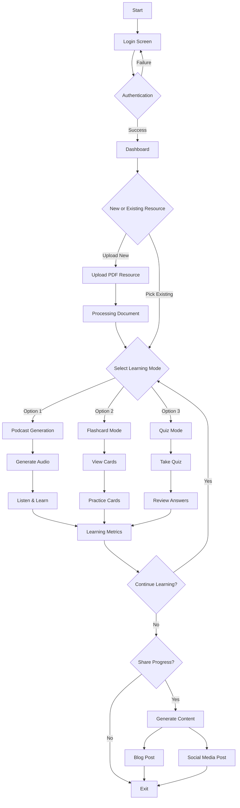
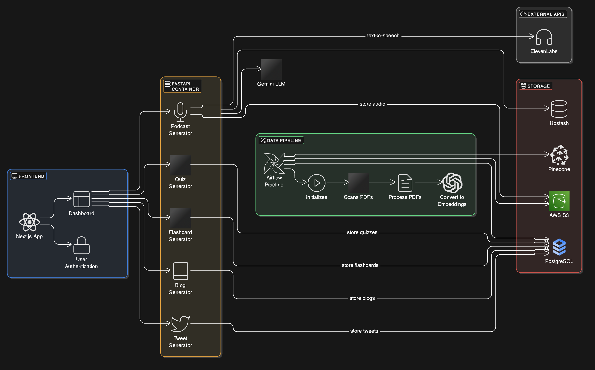
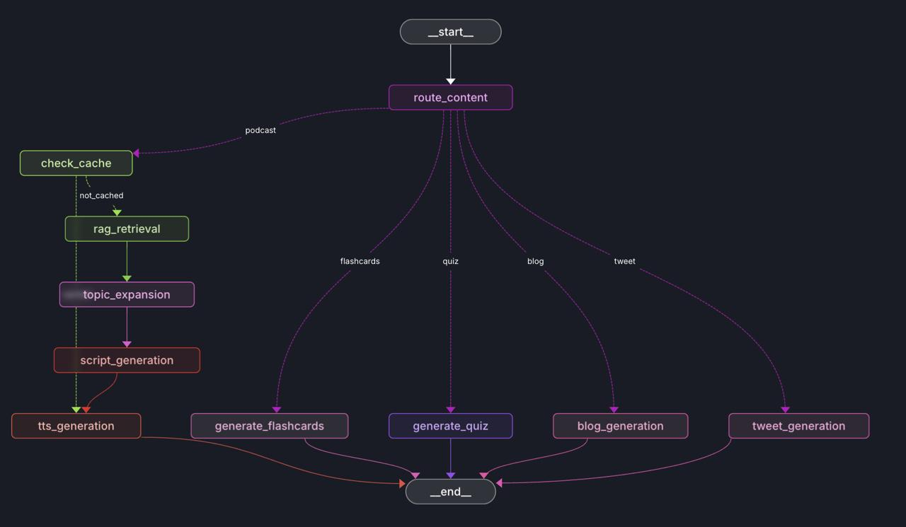

# LearnLab 🎓

[](https://www.python.org/downloads/)
[](https://fastapi.tiangolo.com/)
[](https://nextjs.org/)
[](https://www.docker.com/)
[](LICENSE)
[](https://github.com/psf/black)
[](https://codelabs-preview.appspot.com/?file_id=1kMzJ_qRJrDknPFatF1raPvsoJUatl_-tfJuICo7p4EM#0)

> Enhancing Learning with Fun, Interactive Journeys for Better Comprehension, Revision, and Evaluation.

## Project URLs
- Code Labs: [Codelabs Documentation](https://codelabs-preview.appspot.com/?file_id=1uRDRgIq0stv5MiOj-4f0KLE3mzC15eOw9zI4dzttLGg#0)
- Application: [Front End](http://34.45.163.161:3000/)
- Swagger: [Swagger](http://34.45.163.161:8000/docs)
- Airflow: [Airflow](http://34.45.163.161:8080/)
- Github Tasks: [GitHub Issues and Tasks](https://github.com/orgs/DAMG7245-Big-Data-Sys-SEC-02-Fall24/projects/7/views/1)


## 👥 Team

- Sai Surya Madhav Rebbapragada
- Uday Kiran Dasari (Project Manager)
- Venkat Akash Varun Pemmaraju

---

## User Interaction with LearnLab
1. Upload/Select a PDF.
2. Query and summarize the document.
3. Generate audio podcasts for convenient learning.
4. Create interactive flashcards for revision.
5. Take quizzes to test understanding.
6. Generate and share blogs summarizing key points.

---

## Core Features

### 1. **Podcast Generation**
- Automated script generation from PDFs.
- Dramatized and engaging podcasts for enhanced comprehension.

### 2. **Interactive Flashcards**
- AI-powered extraction of key concepts.
- Categorized by difficulty levels for personalized learning.

### 3. **Content Transformation**
- Platform-specific article generation.
- Efficient citation and reference management.

### 4. **Interactive Quizzes**
- AI-driven question generation.
- Instant feedback with detailed explanations.

---

## Project Overview

### Scope
- PDF processing and storage.
- Multimodal content generation (audio, textual).
- Cloud-based architecture with user authentication.

### Stakeholders
- Students, educators, researchers, professionals, and content creators.

### Problem Statement
- Inefficient comprehension and retention of dense academic content.
- LearnLab resolves this with multimodal, engaging learning experiences.

### Accomplishments
- Reduced podcast generation time by ~50%.
- Robust quiz and flashcard generation.
- Time and resource optimization for content creation.

---

## Methodology

### Podcast Generation
1. **Content Cleaning**: Extract key text using LLMs.
2. **Transcript Creation**: Generate coherent summaries.
3. **Dramatization**: Enhance engagement with LLM dramatization.
4. **Audio Generation**: Convert to audio using TTS tools.

### Flashcard Generation
1. Extract key concepts from PDF.
2. Organize into structured flashcards by difficulty.

### Quiz Generation
- Create interactive MCQs using PDF context and LLMs.

### Blog Generation
- Summarize PDF insights into blogs.
- Share directly on Blogger or social media.

---

## Workflow Overview
1. Audio Podcasts: Learn on the go.
2. Flashcards: Facilitate structured revision.
3. Quizzes: Assess retention and comprehension.
4. Blogs/Social Media: Share insights and collaborate.

---

## 🛠️ Technology Stack

### Backend
- 
- 
- 
- 

### Frontend
- 
- 
- Vercel AI SDK

### AI/ML
- 
- LangGraph
- Gemini Learn LM 1.5
- PyPDF
- 11 Labs
- Pinecone

### Cloud & DevOps
- 
- 
- 
- 
- 

## 🏗️ Architecture

### User Flow


### Agentic architecture





## 🚀 Getting Started

### Prerequisites
- Python 3.9+
- Node.js 16+
- Docker
- GCP Account
- AWS Account


1. **Setup Environment:**
```bash
# Clone repository
git clone https://github.com/DAMG7245-Big-Data-Sys-SEC-02-Fall24/LearnLab
cd LearnLab

# Initialize environments and configurations
# Add all relavent .env files
```

2. **Start Services:**
```bash
# Start all services
docker-compose up -d

# Or start specific services
docker-compose up -d frontend backend
```

## Service Ports

| Service   | Port  | URL                     |
|-----------|-------|-------------------------|
| Frontend  | 3000  | http://localhost:3000   |
| Backend   | 8000  | http://localhost:8000   |
| Airflow   | 8080  | http://localhost:8080   |
| Database  | 5432  | postgres://localhost:5432|

## Essential Commands

### Development
```bash
# Build specific service
docker-compose build <service-name>

# View logs
docker-compose logs -f <service-name>

# Restart service
docker-compose restart <service-name>
```

### Database
```bash
# Access PostgreSQL CLI
docker-compose exec db psql -U postgres

# Backup database
docker-compose exec db pg_dump -U postgres learnlab > backup.sql
```

### Cleanup
```bash
# Stop all services
docker-compose down

# Remove volumes
docker-compose down -v
```

## Project Structure
```
LearnLab/
├── frontend/          # Next.js frontend
├── backend/          # FastAPI backend
├── airflow/          # Airflow DAGs
├── docker/           # Docker configurations
└── docker-compose.yml
```

## Environment Setup
Each service requires its own `.env` file. Copy from `.env.example`:

```bash
cd <service-directory>
cp .env.example .env
```


## 📜 License

This project is licensed under the MIT License - see the [LICENSE](LICENSE) file for details.

## 🔗 References

- [OpenNotebookLM](https://github.com/gabrielchua/open-notebooklm)
- [Bark](https://github.com/suno-ai/bark)
- [Llama Recipes](https://github.com/meta-llama/llama-recipes)
- [EduChain](https://github.com/satvik314/educhain)
- [Consillium App](https://www.consillium.app/)
- [Median](https://github.com/5uru/Median)
