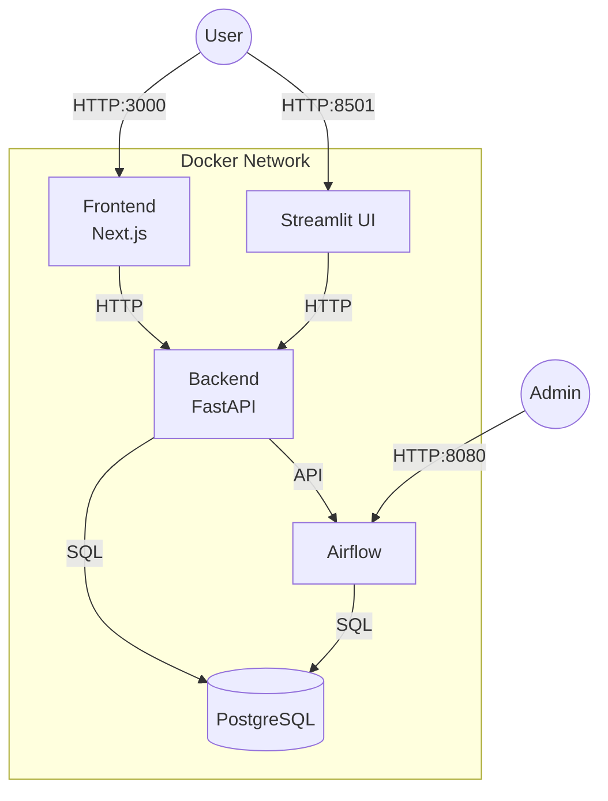
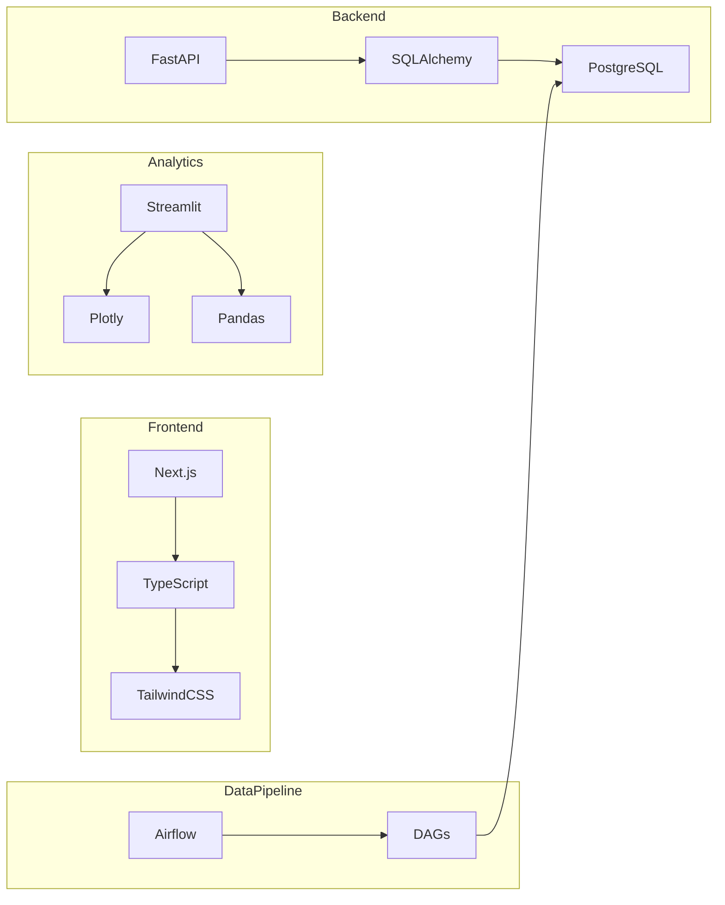

# LearnLab Platform

## Architecture Overview



## Service Architecture



## Quick Start

1. **Setup Environment:**
```bash
# Clone repository
git clone <repository-url>
cd LearnLab

# Initialize environments and configurations
./setup-env.sh
```

2. **Start Services:**
```bash
# Start all services
docker-compose up -d

# Or start specific services
docker-compose up -d frontend backend
```

## Service Ports

| Service   | Port  | URL                     |
|-----------|-------|-------------------------|
| Frontend  | 3000  | http://localhost:3000   |
| Backend   | 8000  | http://localhost:8000   |
| Streamlit | 8501  | http://localhost:8501   |
| Airflow   | 8080  | http://localhost:8080   |
| Database  | 5432  | postgres://localhost:5432|

## Essential Commands

### Development
```bash
# Build specific service
docker-compose build <service-name>

# View logs
docker-compose logs -f <service-name>

# Restart service
docker-compose restart <service-name>
```

### Database
```bash
# Access PostgreSQL CLI
docker-compose exec db psql -U postgres

# Backup database
docker-compose exec db pg_dump -U postgres learnlab > backup.sql
```

### Cleanup
```bash
# Stop all services
docker-compose down

# Remove volumes
docker-compose down -v
```

## Project Structure
```
LearnLab/
├── frontend/          # Next.js frontend
├── backend/          # FastAPI backend
├── streamlit-ui/     # Streamlit analytics
├── airflow/          # Airflow DAGs
├── docker/           # Docker configurations
└── docker-compose.yml
```

## Technology Stack

### Core Services
- **Frontend**: Next.js 15.0.3, TypeScript, TailwindCSS
- **Backend**: FastAPI, SQLAlchemy, Poetry
- **Analytics**: Streamlit, Plotly, Pandas
- **Pipeline**: Apache Airflow 2.7.3
- **Database**: PostgreSQL 15

### Infrastructure
- Docker & Docker Compose
- Python 3.9.6
- Node.js 18
- Poetry for Python dependency management

## Development State

### Completed
- Base service setup with Docker
- Inter-service communication
- Database initialization
- Hot-reload development setup
- Health checks implementation

### In Progress
- API development
- Frontend components
- Data pipeline implementation
- Analytics dashboard

## Environment Setup
Each service requires its own `.env` file. Copy from `.env.example`:

```bash
cd <service-directory>
cp .env.example .env
```

For detailed service-specific documentation, refer to each service's README:
- [Frontend Documentation](frontend/README.md)
- [Backend Documentation](backend/README.md)
- [Streamlit UI Documentation](streamlit-ui/README.md)
- [Airflow Documentation](airflow/README.md)