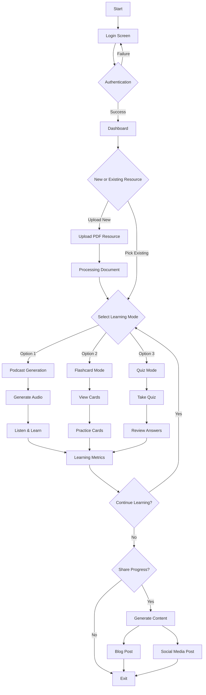
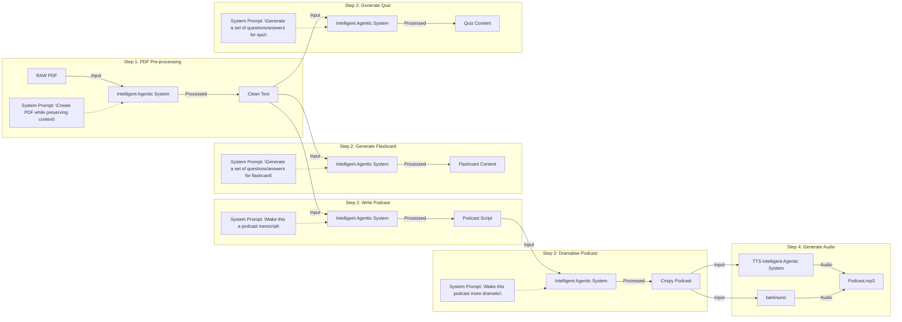

# MultiLearnAI

## Overview
In today's digital learning landscape, there's a growing need for tools that can transform static PDF documents into diverse, interactive learning materials. Currently, learners often struggle to effectively extract, retain, and engage with information from PDF documents, leading to suboptimal learning outcomes.

To develop an intelligent platform that transforms PDF documents into multiple learning formats (audio podcasts, flashcards, quizzes) while automatically generating and distributing content, enabling comprehensive understanding and retention of material through various learning modalities.

The user journey begins with uploading or selecting a PDF, which they can explore using querying and summarization features. Users can then generate an audio podcast to conveniently listen to the document's insights or create flashcards for revision. After engaging with the flashcards, users can take an interactive quiz to test their understanding of the material. Once satisfied, they can use the blog generator to produce a professional article summarizing the document's key points. If the generated blog meets their expectations, they can seamlessly post it to blog and social media post sharing their learning with a broader audience.

- **GitHub Issues and Tasks**: [Link to GitHub Project Issues](https://github.com/orgs/DAMG7245-Big-Data-Sys-SEC-02-Fall24/projects/7/views/1)
- **Codelabs Documentation**: [Link to Codelabs](https://codelabs-preview.appspot.com/?file_id=1kMzJ_qRJrDknPFatF1raPvsoJUatl_-tfJuICo7p4EM#0)
- **Project Submission Video (5 Minutes)**: [Link to Submission Video](https://drive.google.com/drive/u/0/folders/1wgYeUY-HsDuWcqGq1hSNVRQ3gvQBMLZC)

## User Flow Diagram

## Architecture Diagram

