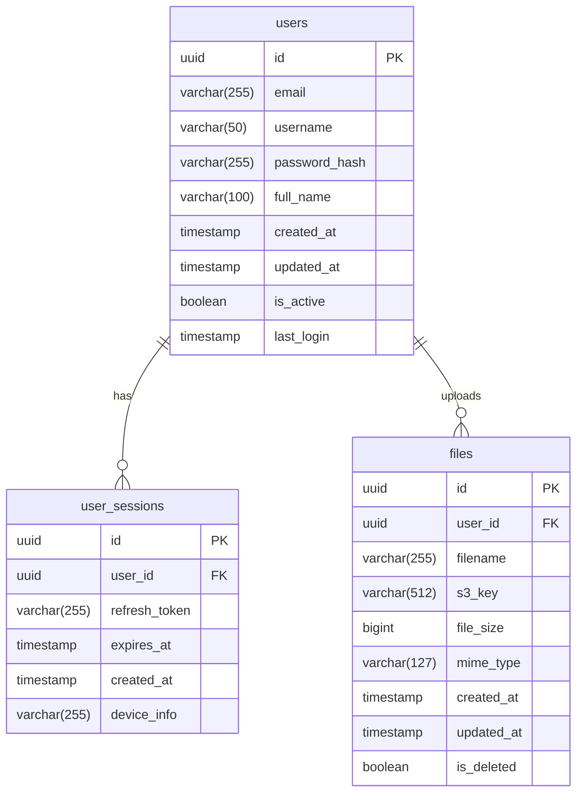
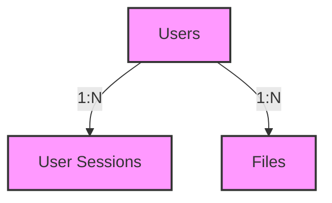

# LearnLab Database Documentation

## Database Schema Overview



## Detailed Table Specifications

### Users Table

The users table stores core user information and authentication details.

```sql
CREATE TABLE users (
    id UUID PRIMARY KEY DEFAULT uuid_generate_v4(),
    email VARCHAR(255) UNIQUE NOT NULL,
    username VARCHAR(50) UNIQUE NOT NULL,
    password_hash VARCHAR(255) NOT NULL,
    full_name VARCHAR(100),
    created_at TIMESTAMP WITH TIME ZONE DEFAULT CURRENT_TIMESTAMP,
    updated_at TIMESTAMP WITH TIME ZONE DEFAULT CURRENT_TIMESTAMP,
    is_active BOOLEAN DEFAULT true,
    last_login TIMESTAMP WITH TIME ZONE
);

-- Indexes
CREATE INDEX idx_users_email ON users(email);
CREATE INDEX idx_users_username ON users(username);
```

#### Column Descriptions
| Column         | Type                     | Description                                       | Constraints |
|---------------|--------------------------|---------------------------------------------------|-------------|
| id            | UUID                     | Unique identifier for the user                    | PK, NOT NULL |
| email         | VARCHAR(255)             | User's email address                             | UNIQUE, NOT NULL |
| username      | VARCHAR(50)              | User's chosen username                           | UNIQUE, NOT NULL |
| password_hash | VARCHAR(255)             | Bcrypt hashed password                          | NOT NULL |
| full_name     | VARCHAR(100)             | User's full name                                | NULLABLE |
| created_at    | TIMESTAMP WITH TIME ZONE | Account creation timestamp                      | DEFAULT CURRENT_TIMESTAMP |
| updated_at    | TIMESTAMP WITH TIME ZONE | Last update timestamp                           | DEFAULT CURRENT_TIMESTAMP |
| is_active     | BOOLEAN                  | Whether the account is active                   | DEFAULT true |
| last_login    | TIMESTAMP WITH TIME ZONE | Timestamp of last successful login             | NULLABLE |

### User Sessions Table

Manages refresh tokens for user authentication sessions.

```sql
CREATE TABLE user_sessions (
    id UUID PRIMARY KEY DEFAULT uuid_generate_v4(),
    user_id UUID NOT NULL REFERENCES users(id) ON DELETE CASCADE,
    refresh_token VARCHAR(255) NOT NULL,
    expires_at TIMESTAMP WITH TIME ZONE NOT NULL,
    created_at TIMESTAMP WITH TIME ZONE DEFAULT CURRENT_TIMESTAMP,
    device_info VARCHAR(255),
    UNIQUE(user_id, refresh_token)
);

-- Indexes
CREATE INDEX idx_user_sessions_user_id ON user_sessions(user_id);
CREATE INDEX idx_user_sessions_token ON user_sessions(refresh_token);
```

#### Column Descriptions
| Column         | Type                     | Description                                    | Constraints |
|---------------|--------------------------|------------------------------------------------|-------------|
| id            | UUID                     | Unique identifier for the session             | PK, NOT NULL |
| user_id       | UUID                     | Reference to the users table                  | FK, NOT NULL |
| refresh_token | VARCHAR(255)             | JWT refresh token                             | NOT NULL |
| expires_at    | TIMESTAMP WITH TIME ZONE | Token expiration timestamp                    | NOT NULL |
| created_at    | TIMESTAMP WITH TIME ZONE | Session creation timestamp                    | DEFAULT CURRENT_TIMESTAMP |
| device_info   | VARCHAR(255)             | User agent or device information             | NULLABLE |

### Files Table

Stores metadata for user-uploaded files with S3 references.

```sql
CREATE TABLE files (
    id UUID PRIMARY KEY DEFAULT uuid_generate_v4(),
    user_id UUID NOT NULL REFERENCES users(id) ON DELETE CASCADE,
    filename VARCHAR(255) NOT NULL,
    s3_key VARCHAR(512) NOT NULL,
    file_size BIGINT NOT NULL,
    mime_type VARCHAR(127),
    created_at TIMESTAMP WITH TIME ZONE DEFAULT CURRENT_TIMESTAMP,
    updated_at TIMESTAMP WITH TIME ZONE DEFAULT CURRENT_TIMESTAMP,
    is_deleted BOOLEAN DEFAULT false
);

-- Indexes
CREATE INDEX idx_files_user_id ON files(user_id);
CREATE INDEX idx_files_user_id_deleted ON files(user_id, is_deleted);
```

#### Column Descriptions
| Column      | Type                     | Description                                    | Constraints |
|------------|--------------------------|------------------------------------------------|-------------|
| id         | UUID                     | Unique identifier for the file                | PK, NOT NULL |
| user_id    | UUID                     | Reference to the users table                  | FK, NOT NULL |
| filename   | VARCHAR(255)             | Original filename                             | NOT NULL |
| s3_key     | VARCHAR(512)             | S3 object key                                 | NOT NULL |
| file_size  | BIGINT                   | File size in bytes                            | NOT NULL |
| mime_type  | VARCHAR(127)             | File MIME type                                | NULLABLE |
| created_at | TIMESTAMP WITH TIME ZONE | File upload timestamp                         | DEFAULT CURRENT_TIMESTAMP |
| updated_at | TIMESTAMP WITH TIME ZONE | Last modification timestamp                   | DEFAULT CURRENT_TIMESTAMP |
| is_deleted | BOOLEAN                  | Soft delete flag                              | DEFAULT false |

## Database Relationships



### Relationship Details

1. **Users to User Sessions (1:N)**
   - One user can have multiple active sessions
   - Sessions are deleted when user is deleted (CASCADE)
   - Unique constraint on user_id + refresh_token pair

2. **Users to Files (1:N)**
   - One user can have multiple files
   - Files are soft-deleted (is_deleted flag)
   - Files maintain user reference even when deleted

## Database Indexing Strategy

### Users Table Indexes
- Primary Key: id (UUID)
- Unique Index: email
- Unique Index: username
- Purpose: Fast user lookup during authentication

### User Sessions Table Indexes
- Primary Key: id (UUID)
- Index: user_id
- Index: refresh_token
- Purpose: Efficient token validation and session management

### Files Table Indexes
- Primary Key: id (UUID)
- Index: user_id
- Composite Index: (user_id, is_deleted)
- Purpose: Fast file listing and pagination per user

## Data Integrity

### Constraints
1. **Foreign Key Constraints**
   - user_sessions.user_id → users.id (CASCADE)
   - files.user_id → users.id (CASCADE)

2. **Unique Constraints**
   - users.email
   - users.username
   - user_sessions(user_id, refresh_token)

3. **Not Null Constraints**
   - Critical identification fields
   - Authentication fields
   - File metadata fields

### Timestamps
- All tables include created_at
- Users and files include updated_at
- Automatic timestamp updates on record modification

## Query Examples

### User Authentication
```sql
-- Get user by email with active status
SELECT * FROM users 
WHERE email = $1 AND is_active = true;

-- Update last login time
UPDATE users 
SET last_login = CURRENT_TIMESTAMP 
WHERE id = $1;
```

### Session Management
```sql
-- Create new session
INSERT INTO user_sessions (user_id, refresh_token, expires_at)
VALUES ($1, $2, $3);

-- Clean expired sessions
DELETE FROM user_sessions 
WHERE expires_at < CURRENT_TIMESTAMP;
```

### File Operations
```sql
-- List user's files with pagination
SELECT * FROM files 
WHERE user_id = $1 AND is_deleted = false 
ORDER BY created_at DESC 
LIMIT $2 OFFSET $3;

-- Soft delete file
UPDATE files 
SET is_deleted = true 
WHERE id = $1 AND user_id = $2;
```

## Backup Strategy

### Backup Components
1. Database dumps
2. S3 file backups
3. User session cleanup

### Backup Schedule
```mermaid
gantt
    title Backup Schedule
    dateFormat  YYYY-MM-DD
    section Database
    Full Backup     :daily
    section S3
    File Sync       :weekly
    section Sessions
    Cleanup         :daily
```

## Database Migrations

Database migrations are managed using Alembic. Migration files are stored in the `migrations` directory and versioned with the application.