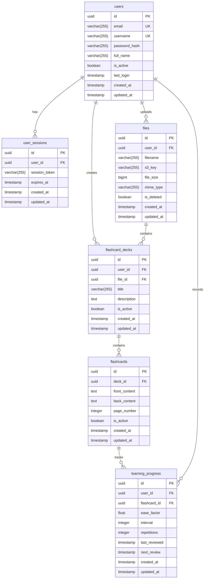

# LearnLab Database Documentation

## Database Schema Overview



## Table Specifications

### Users Table
```sql
CREATE TABLE users (
    id UUID PRIMARY KEY DEFAULT uuid_generate_v4(),
    email VARCHAR(255) UNIQUE NOT NULL,
    username VARCHAR(255) UNIQUE NOT NULL,
    password_hash VARCHAR(255) NOT NULL,
    full_name VARCHAR(255),
    is_active BOOLEAN DEFAULT true,
    last_login TIMESTAMP WITH TIME ZONE,
    created_at TIMESTAMP WITH TIME ZONE DEFAULT CURRENT_TIMESTAMP,
    updated_at TIMESTAMP WITH TIME ZONE DEFAULT CURRENT_TIMESTAMP
);
```

### Files Table
```sql
CREATE TABLE files (
    id UUID PRIMARY KEY DEFAULT uuid_generate_v4(),
    user_id UUID REFERENCES users(id) ON DELETE CASCADE,
    filename VARCHAR(255) NOT NULL,
    s3_key VARCHAR(255) NOT NULL,
    file_size BIGINT,
    mime_type VARCHAR(255),
    is_deleted BOOLEAN DEFAULT false,
    created_at TIMESTAMP WITH TIME ZONE DEFAULT CURRENT_TIMESTAMP,
    updated_at TIMESTAMP WITH TIME ZONE DEFAULT CURRENT_TIMESTAMP
);
```

### Flashcard Decks Table
```sql
CREATE TABLE flashcard_decks (
    id UUID PRIMARY KEY DEFAULT uuid_generate_v4(),
    user_id UUID REFERENCES users(id) ON DELETE CASCADE,
    file_id UUID REFERENCES files(id) ON DELETE CASCADE,
    title VARCHAR(255) NOT NULL,
    description TEXT,
    is_active BOOLEAN DEFAULT true,
    created_at TIMESTAMP WITH TIME ZONE DEFAULT CURRENT_TIMESTAMP,
    updated_at TIMESTAMP WITH TIME ZONE DEFAULT CURRENT_TIMESTAMP,
    CONSTRAINT unique_active_deck_per_file UNIQUE NULLS NOT DISTINCT (file_id, is_active)
);
```

### Flashcards Table
```sql
CREATE TABLE flashcards (
    id UUID PRIMARY KEY DEFAULT uuid_generate_v4(),
    deck_id UUID REFERENCES flashcard_decks(id) ON DELETE CASCADE,
    front_content TEXT NOT NULL,
    back_content TEXT NOT NULL,
    page_number INTEGER,
    is_active BOOLEAN DEFAULT true,
    created_at TIMESTAMP WITH TIME ZONE DEFAULT CURRENT_TIMESTAMP,
    updated_at TIMESTAMP WITH TIME ZONE DEFAULT CURRENT_TIMESTAMP
);
```

### Learning Progress Table
```sql
CREATE TABLE learning_progress (
    id UUID PRIMARY KEY DEFAULT uuid_generate_v4(),
    user_id UUID REFERENCES users(id) ON DELETE CASCADE,
    flashcard_id UUID REFERENCES flashcards(id) ON DELETE CASCADE,
    ease_factor FLOAT DEFAULT 2.5,
    interval INTEGER DEFAULT 0,
    repetitions INTEGER DEFAULT 0,
    last_reviewed TIMESTAMP WITH TIME ZONE,
    next_review TIMESTAMP WITH TIME ZONE,
    created_at TIMESTAMP WITH TIME ZONE DEFAULT CURRENT_TIMESTAMP,
    updated_at TIMESTAMP WITH TIME ZONE DEFAULT CURRENT_TIMESTAMP
);
```

## Database Indexing Strategy

### Core Indexes
```sql
-- User-related indexes
CREATE INDEX idx_users_email ON users(email);
CREATE INDEX idx_users_username ON users(username);

-- File-related indexes
CREATE INDEX idx_files_user_id ON files(user_id);
CREATE INDEX idx_files_is_deleted ON files(is_deleted);

-- Flashcard deck indexes
CREATE INDEX idx_flashcard_decks_user_id ON flashcard_decks(user_id);
CREATE INDEX idx_flashcard_decks_file_id ON flashcard_decks(file_id);
CREATE INDEX idx_flashcard_decks_is_active ON flashcard_decks(is_active);

-- Flashcard indexes
CREATE INDEX idx_flashcards_deck_id ON flashcards(deck_id);
CREATE INDEX idx_flashcards_is_active ON flashcards(is_active);
CREATE INDEX idx_flashcards_page_number ON flashcards(page_number);

-- Learning progress indexes
CREATE INDEX idx_learning_progress_user_id ON learning_progress(user_id);
CREATE INDEX idx_learning_progress_flashcard_id ON learning_progress(flashcard_id);
CREATE INDEX idx_learning_progress_next_review ON learning_progress(next_review);
```

## Automatic Timestamp Updates

A trigger function updates the `updated_at` timestamp automatically:

```sql
CREATE OR REPLACE FUNCTION update_updated_at_column()
RETURNS TRIGGER AS $$
BEGIN
    NEW.updated_at = CURRENT_TIMESTAMP;
    RETURN NEW;
END;
$$ language 'plpgsql';
```

Applied to all tables with `updated_at`:
```sql
CREATE TRIGGER update_users_updated_at
    BEFORE UPDATE ON users
    FOR EACH ROW
    EXECUTE FUNCTION update_updated_at_column();
-- Similar triggers for other tables
```

## Useful Views

### User Study Statistics
```sql
CREATE OR REPLACE VIEW user_study_stats AS
SELECT 
    u.id as user_id,
    u.email,
    u.username,
    COUNT(DISTINCT fd.id) as total_decks,
    COUNT(DISTINCT f.id) as total_cards,
    COUNT(DISTINCT fd.file_id) as files_with_decks,
    COALESCE(AVG(lp.ease_factor), 2.5) as avg_performance
FROM users u
LEFT JOIN flashcard_decks fd ON u.id = fd.user_id AND fd.is_active = true
LEFT JOIN flashcards f ON fd.id = f.deck_id AND f.is_active = true
LEFT JOIN learning_progress lp ON f.id = lp.flashcard_id
GROUP BY u.id, u.email, u.username;
```

### Due Cards View
```sql
CREATE OR REPLACE VIEW due_cards_view AS
SELECT 
    lp.user_id,
    fd.id as deck_id,
    fd.title as deck_title,
    f.file_id,
    COUNT(*) as due_cards_count
FROM learning_progress lp
JOIN flashcards f ON lp.flashcard_id = f.id AND f.is_active = true
JOIN flashcard_decks fd ON f.deck_id = fd.id AND fd.is_active = true
WHERE lp.next_review <= CURRENT_TIMESTAMP
GROUP BY lp.user_id, fd.id, fd.title, f.file_id;
```

## Helper Functions

### Deck Statistics
```sql
CREATE OR REPLACE FUNCTION get_deck_statistics(deck_id_param UUID)
RETURNS TABLE (
    total_cards INTEGER,
    mastered_cards INTEGER,
    learning_cards INTEGER,
    mastery_percentage NUMERIC,
    distinct_pages INTEGER
) AS $$
BEGIN
    RETURN QUERY
    SELECT 
        COUNT(DISTINCT f.id)::INTEGER as total_cards,
        COUNT(DISTINCT CASE WHEN lp.interval >= 21 THEN f.id END)::INTEGER as mastered_cards,
        COUNT(DISTINCT CASE WHEN lp.interval < 21 THEN f.id END)::INTEGER as learning_cards,
        ROUND(COUNT(DISTINCT CASE WHEN lp.interval >= 21 THEN f.id END)::NUMERIC / 
              NULLIF(COUNT(DISTINCT f.id), 0) * 100, 2) as mastery_percentage,
        COUNT(DISTINCT f.page_number)::INTEGER as distinct_pages
    FROM flashcards f
    LEFT JOIN learning_progress lp ON f.id = lp.flashcard_id
    WHERE f.deck_id = deck_id_param
    AND f.is_active = true;
END;
$$ LANGUAGE plpgsql;
```

## Key Constraints

1. **Unique Constraints**
   - Users: email, username
   - Active deck per file: `unique_active_deck_per_file`

2. **Foreign Key Relationships**
   - All foreign keys use CASCADE delete
   - Files → Users
   - Flashcard Decks → Users and Files
   - Flashcards → Flashcard Decks
   - Learning Progress → Users and Flashcards

3. **Default Values**
   - UUIDs: Generated using uuid_generate_v4()
   - Timestamps: CURRENT_TIMESTAMP
   - is_active/is_deleted: Boolean defaults
   - Learning Progress: ease_factor=2.5, interval=0, repetitions=0

## Database Initialization

```bash
# Enable UUID extension
CREATE EXTENSION IF NOT EXISTS "uuid-ossp";

# Run initialization script
psql -U postgres -d learnlab -f init.sql

# Verify tables
\dt

# Verify views
\dv

# Verify functions
\df
```
